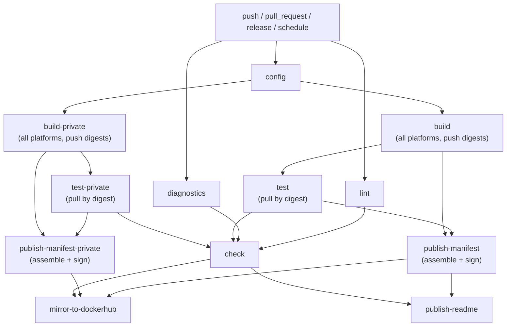

# reusable-workflows #

[](https://github.com/felddy/reusable-workflows/actions/workflows/_build.yml)
[](https://github.com/felddy/reusable-workflows/pkgs/container/reusable-workflow/versions?filters%5Bversion_type%5D=tagged)

This repository contains reusable GitHub Actions workflows for use in other repositories.

## Workflow Composition ##

`_build.yml` is the entry-point orchestrator that wires the reusable building
blocks into a complete CI pipeline. All other workflows are reusable building
blocks intended to be called from an orchestrator.

| Workflow | Type | Purpose |
| --- | --- | --- |
| `_build.yml` | Orchestrator | Full CI pipeline: build → test → publish |
| `container-build.yml` | Reusable | Build all platforms, push digests |
| `container-publish-manifest.yml` | Reusable | Assemble + sign multi-arch manifest |
| `container-test.yml` | Reusable | Pull image from registry and run pytest |
| `container-metadata.yml` | Reusable | Generate OCI tags, labels, annotations |
| `container-mirror.yml` | Reusable | Mirror image to another registry |
| `common-lint.yml` | Reusable | Run linters across the repository |
| `diagnostics.yml` | Reusable | Emit runner and environment diagnostics |
| `_config.yml` | Reusable | Emit repository-specific build configuration |
| `dockerhub-description.yml` | Reusable | Publish README to DockerHub |

### Pipeline Flow ###



### Three-Stage Design ###

The pipeline is split into three distinct stages to catch failures early and
ensure the tested image is identical to what gets published.

**Build** — `container-build.yml` pushes each platform image to the registry
by digest only. No manifest is assembled at this stage, so no tag is created
yet. This keeps the build phase fast and focused.

**Test** — `container-test.yml` pulls the image directly from ghcr.io using
the digest produced by the build stage. Pulling by digest (rather than loading
a tar artifact) means the tested image is byte-for-byte identical to what will
appear in the final manifest. It also avoids the overhead of exporting and
re-importing large tar files, and works naturally with multi-platform builds
where each platform has its own digest.

**Publish manifest** — `container-publish-manifest.yml` assembles the
multi-arch manifest, attests provenance, and signs the result. This job only
runs after the corresponding test job succeeds, so a manifest is never
published for an untested image.

### Concurrency Group ###

`_build.yml` defines a concurrency group keyed on the workflow name and the
branch name:

```yaml
concurrency:
  group: >-
    ${{ github.workflow }}-${{
      github.event.pull_request.head.ref || github.ref_name }}
  cancel-in-progress: true
```

When a pull request event fires on a branch that already has a running push
event workflow, the push run is cancelled and the PR run proceeds. For
`schedule` and `workflow_dispatch` events on `main`, the group key resolves to
`main` so concurrent scheduled runs cancel each other. This eliminates
redundant duplicate runs without any per-job conditionals.

## Contributing ##

We welcome contributions!  Please see [`CONTRIBUTING.md`](CONTRIBUTING.md) for
details.

## License ##

This project is in the worldwide [public domain](LICENSE).

This project is in the public domain within the United States, and
copyright and related rights in the work worldwide are waived through
the [CC0 1.0 Universal public domain
dedication](https://creativecommons.org/publicdomain/zero/1.0/).

All contributions to this project will be released under the CC0
dedication. By submitting a pull request, you are agreeing to comply
with this waiver of copyright interest.
